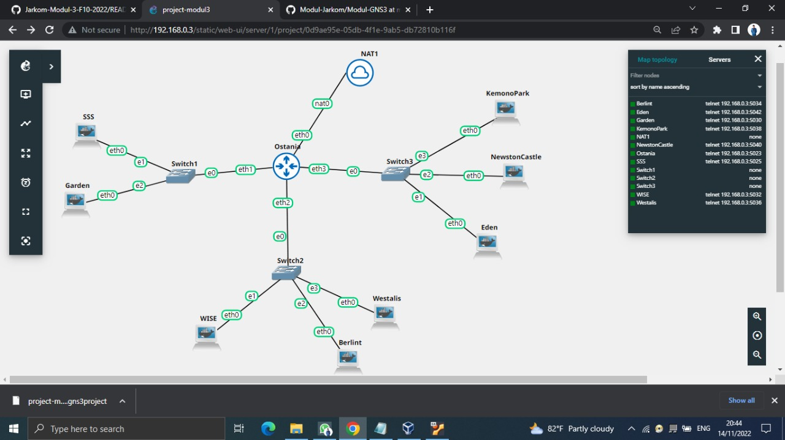

# Jarkom-Modul-3-F10-2022

Kelompok F10 <br/>
Luthfiyyah Hanifah A  5025201090 <br/>
Rachel Anggieuli AP   5025201263 <br/>
Cholid Junoto         5025201038 <br/>

## Laporan Resmi Modul 3 F10 2022

###1. Loid bersama Franky berencana membuat peta tersebut dengan kriteria WISE sebagai DNS Server, Westalis sebagai DHCP Server, Berlint sebagai Proxy Server


#Configurasi DNS Server/Wise
```
auto eth0
iface eth0 inet static
	address 192.204.2.2
	netmask 255.255.255.0
	gateway 192.204.2.1
```
Install bind9 
```
echo "nameserver 192.168.122.1" > /etc/resolv.conf
apt-get update
apt-get install bind9 -y
```
#Configurasi DHCP Server/Westalis
```
auto eth0
iface eth0 inet static
	address 192.204.2.4
	netmask 255.255.255.0
	gateway 192.204.2.1
```
Install DHCP Server
```
echo "nameserver 192.168.122.1" > /etc/resolv.conf

apt-get update
apt-get install isc-dhcp-server -y
```
#Configurasi Proxy Server/Berlint
```
auto eth0
iface eth0 inet static
	address 192.204.2.3
	netmask 255.255.255.0
	gateway 192.204.2.1
```
Install libapache2
```
echo "nameserver 192.168.122.1" > /etc/resolv.conf
apt-get update
apt-get install libapache2-mod-php7.0 -y
apt-get install squid -y
```
### 2. Ostania sebagai DHCP Relay (2). Loid dan Franky menyusun peta tersebut dengan hati-hati dan teliti.
#Configurasi Onstania
```
auto eth0
iface eth0 inet dhcp

auto eth1
iface eth1 inet static
	address 192.204.1.1
	netmask 255.255.255.0

auto eth2
iface eth2 inet static
	address 192.204.2.1
	netmask 255.255.255.0

auto eth3
iface eth3 inet static
        address 192.204.3.1
        netmask 255.255.255.0
```
Install DHCP Relay
```
iptables -t nat -A POSTROUTING -o eth0 -j MASQUERADE -s 192.204.0.0/16
apt-get update
echo "192.204.2.4" | apt-get install isc-dhcp-relay -y
```

Ada beberapa kriteria yang ingin dibuat oleh Loid dan Franky, yaitu:
Semua client yang ada HARUS menggunakan konfigurasi IP dari DHCP Server.

### 3. Client yang melalui Switch1 mendapatkan range IP dari [prefix IP].1.50 - [prefix IP].1.88 dan [prefix IP].1.120 - [prefix IP].1.155
Configurasi Client SSS dan Garden
```
auto eth0
iface eth0 inet dhcp
```
Setelah ini pada Westalis kita ketikkan ```> /etc/default/isc-dhcp-server``` kemudian kita menuliskan ```INTERFACES=\"eth0\"``` lalu kita juga menambahkan 
```subnet 192.204.1.0 netmask 255.255.255.0 {
    range 192.204.1.50 192.204.1.88;
    range 192.204.1.120 192.204.1.155;
    option routers 192.204.1.1;
    option broadcast-address 192.204.1.255;
    option domain-name-servers 192.204.2.2;
    default-lease-time 300;
    max-lease-time 6900;
} 
```
pada ```/etc/dhcp/dhcpd.conf ``` kemudian kita reset dengan ```service isc-dhcp-server restart```
Untuk melakukan pengecekan kita ketik ```ip a``` pada client yang berada di switch 1 (SSS dan Garden)

### 4. Client yang melalui Switch3 mendapatkan range IP dari [prefix IP].3.10 - [prefix IP].3.30 dan [prefix IP].3.60 - [prefix IP].3.85 

Cofigurasi Pada Client Pada KemonoPark dan NewstonCastle
```
auto eth0
iface eth0 inet dhcp
```
Cofigurasi Pada Client Pada Eden
```
auto eth0
iface eth0 inet dhcp
hwaddress ether 82:ca:27:cc:c1:74
```
Setelah ini pada Westalis kita ketikkan kembali  ```/etc/dhcp/dhcpd.conf ``` dan kita tambahkan script di bawah
```subnet 192.204.3.0 netmask 255.255.255.0 {
    range 192.204.3.10 192.204.3.30;
    range 192.204.3.60 192.204.3.85;
    option routers 192.204.3.1;
    option broadcast-address 192.204.3.255;
    option domain-name-servers 192.204.2.2;
    default-lease-time 600;
    max-lease-time 6900;
}
```
kemudian kita reset dengan ```service isc-dhcp-server restart```
Untuk melakukan pengecekan kita ketik ```ip a``` pada client yang berada di switch 3 (Eden,KemonoPark dan NewstonCastle)

### 5. Client mendapatkan DNS dari WISE dan client dapat terhubung dengan internet melalui DNS tersebut.
Karena setiap Client mendapatkan DNS dari WISE dan Client bisa terhubung internet melalui DNS tersebut, maka di butuhkan configurasi pada 
```s/etc/dhcp/dhcpd.conf``` di westalis, lalu kita tambahkan ```option domain-name-servers 192.204.2.2;```

Kemudian kita lakukan setup pada Wise dengan ```/etc/bind/named.conf.options``` kemudian kita tuliskan 
```options {
        directory \"/var/cache/bind\";
 forwarders {
                192.168.122.1;
        };

        allow-query{any;};
 auth-nxdomain no;    # conform to RFC1035
        listen-on-v6 { any; };
};
```
Lalu bisa di lakukan ping google.com pada setiap client.

### 6. Lama waktu DHCP server meminjamkan alamat IP kepada Client yang melalui Switch1 selama 5 menit sedangkan pada client yang melalui Switch3 selama 10 menit. Dengan waktu maksimal yang dialokasikan untuk peminjaman alamat IP selama 115 menit.	

### 7. Loid dan Franky berencana menjadikan Eden sebagai server untuk pertukaran informasi dengan alamat IP yang tetap dengan IP [prefix IP].3.13 
